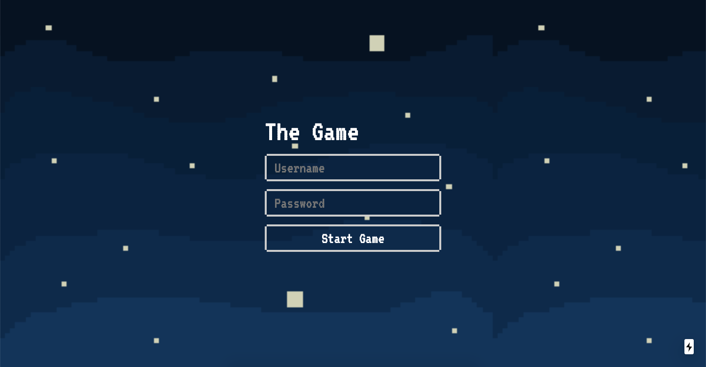
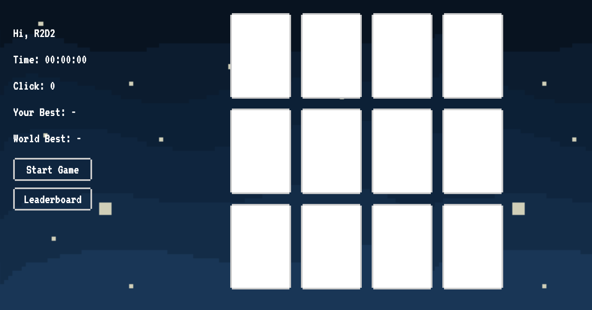
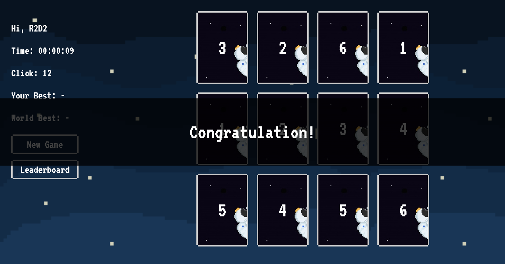
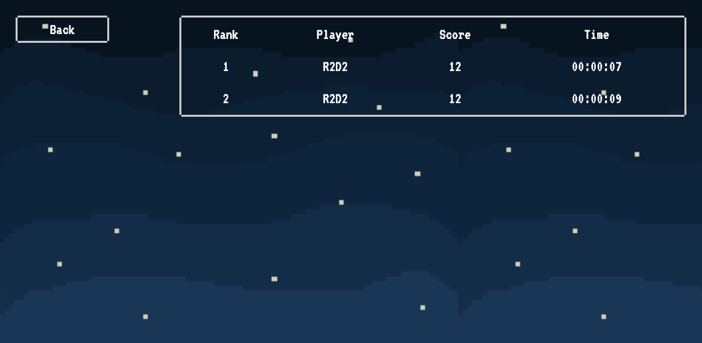

# Card Match Game

> Matching cards is a fun and addictive puzzle game. Find all the matching pairs of cards.

## Screenshots






### Required
- Node.js > 10.x
- Python > 3.x
- Mysql > 5.6

## Tech/framework used

- Next.js (Frontend)
- Flask (Backend)
- Mysql (Database)


## Installation


```sh
make install.frontend
make install.server
```

## Start
```sh
make start.frontend
make start.server
```

## Tests

```sh
make test
```

## API Document

`/apidocs`

## License

A short snippet describing the license (MIT, Apache etc)

MIT © [Wasu Winitmontri]()
